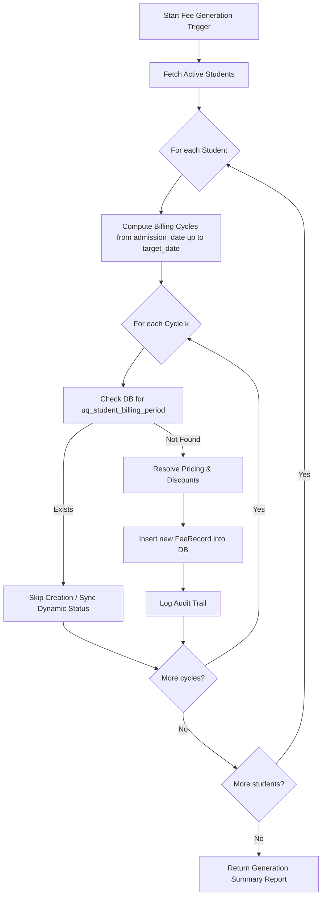
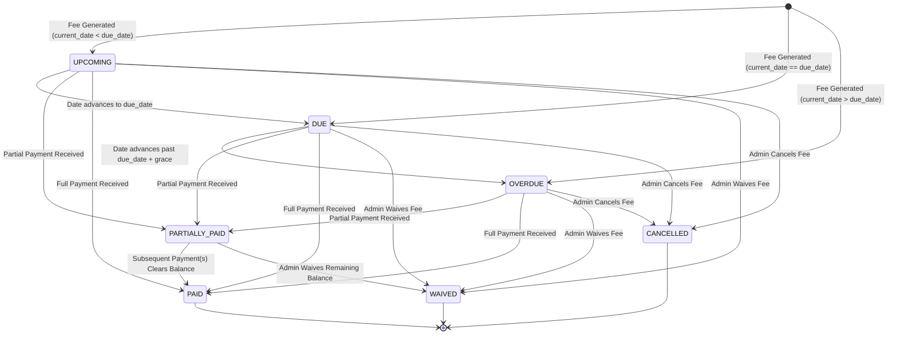
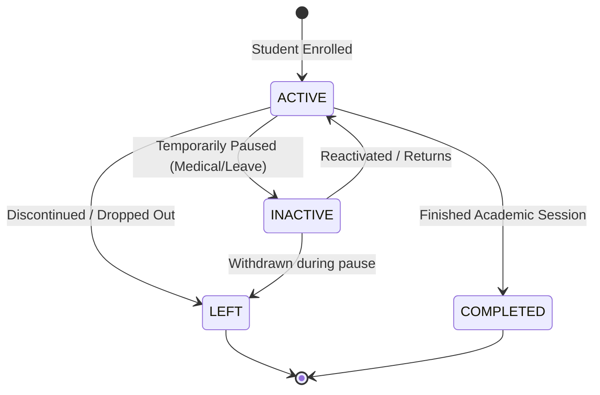

# DPR Fee Management System — Fee Engine & Business Domain Specification

**Document Version**: 1.0.0  
**Domain Mining Author**: Miner Survey 2 (Fee Engine & Business Domain Spec Miner)  
**Date**: 2026-08-15  
**Integrity Mode**: Production / Standard Compliant  

---

## 1. Executive Domain Summary & Architecture Overview

The **DPR Fee Management System** is a mission-critical financial and student administration engine tailored specifically for **DPR Private Tuition**. Unlike traditional institutional ERPs that force uniform 1st-of-month billing cycles, DPR Tuition charges tuition fees on an **individual student admission/joining date cycle** (e.g. May 3 to June 2, due June 3).

The business domain is governed by four foundational principles:
1. **Admission Date Anchor Billing**: Billing periods are strictly derived from the student's unique admission date anchor.
2. **Two-Tier Fee Configuration with Snapshot Immutability**: Students either inherit dynamic class default fees (`DEFAULT`) or hold locked custom rates (`CUSTOM`). Historical generated fee records are immutable snapshots that never mutate when class or student rates change.
3. **Strict Idempotency**: Fee generation is protected at the database constraint level (`UNIQUE(student_id, billing_period_start, billing_period_end)`) ensuring repeated runs produce identical, non-duplicative state.
4. **Deterministic Multi-State Payment & Overdue Lifecycle**: Robust state transitions (`UPCOMING` -> `DUE` -> `PARTIALLY_PAID` / `PAID` / `OVERDUE` / `WAIVED` / `CANCELLED`) with support for cumulative partial payments and configurable class-level late fees.

---

## 2. Features Discovered

| # | Category | Feature | Description | Inputs | Outputs | Error Behavior | Discovered Via |
|---|----------|---------|-------------|--------|---------|----------------|----------------|
| 1 | Billing Engine | Admission-Date Billing Cycle | Generates monthly billing cycles starting on the student's admission date anchor day rather than the 1st of calendar months. | `admission_date`, `cycle_index` | `billing_period_start`, `billing_period_end`, `due_date` | Rejects invalid dates; handles non-existent days by clamping to month end. | R1, Acceptance Criteria |
| 2 | Billing Engine | Edge-Case Date Math | Clamps anchor days (28th, 29th, 30th, 31st) across short months (Feb, Apr, Jun, Sep, Nov) and leap years without drifting future months. | `admission_date`, `month_offset` | Normalized UTC start/end dates | Clamps to `lastDayOfMonth` when anchor day > days in target month. | R1, Acceptance Criteria |
| 3 | Fee Mode | Class Fee Inheritance (`DEFAULT`) | Automatically resolves student fee from Class `default_monthly_fee` at the moment of billing cycle generation. | `class.default_monthly_fee`, `student.fee_mode` | Generated fee record with class fee | Throws error if class has invalid or missing fee configuration. | R1, R2, Acceptance Criteria |
| 4 | Fee Mode | Custom Student Fee (`CUSTOM`) | Locks student monthly fee to a personalized rate (`custom_monthly_fee`) immune to class fee updates. | `student.custom_monthly_fee`, `student.fee_mode` | Generated fee record with custom rate | Throws validation error if `custom_monthly_fee` is null/negative when `fee_mode=CUSTOM`. | R1, R2, Acceptance Criteria |
| 5 | Fee Engine | Fee Record Immutability | Freezes base amount, discounts, late fees, and class snapshot at the time of fee record generation. | Generated `fee_record` | Immutable database record | Changes to Class or Student profiles only affect future ungenerated cycles; past records are read-only. | R1, Acceptance Criteria |
| 6 | Fee Engine | Idempotent Fee Generation | Prevents duplicate billing records for the same student and period using DB unique constraints. | `student_id`, `period_start`, `period_end` | New record created or existing record skipped | DB unique constraint violation caught and skipped gracefully. | R1, Acceptance Criteria |
| 7 | Fee Engine | Batch Fee Generator | Scans all `ACTIVE` students and generates missing fee cycles up to current date or next billing cycle. | `through_date`, optional `class_id` | Summary: `{ created: N, skipped: M, errors: [] }` | Logs individual student failures without aborting batch transaction. | R1, R4 |
| 8 | Discount Engine | Fixed & Percentage Discounts | Applies discounts to base fee (e.g. ₹100 flat or 10% off) with audit reasons (sibling discount, merit). | `discount_type`, `discount_value`, `base_amount` | `discount_amount`, `final_amount` | Rejects discount_value > base_fee (fixed) or > 100 (percentage). | R1, R2 |
| 9 | Fee Lifecycle | Status State Machine | Evaluates fee status (`UPCOMING`, `DUE`, `PARTIALLY_PAID`, `PAID`, `OVERDUE`, `WAIVED`, `CANCELLED`) dynamically and on payment events. | `due_date`, `total_amount`, `paid_amount`, `current_date` | Status Enum | Clear error if transitioning from locked states (PAID, CANCELLED) invalidly. | R1, R3, Acceptance Criteria |
| 10 | Late Fees | Configurable Late Fee Engine | Computes optional class-level late fees (fixed or per-day) after due date + grace days. Disabled by default. | `late_fee_enabled`, `late_fee_type`, `late_fee_amount`, `grace_days` | Computed `late_fee_amount` | Returns 0 if `late_fee_enabled = false` or within grace period. | R1 |
| 11 | Numbering | Unique Student Code Generator | Generates sequential identifiers in format `DPR-{YEAR}-{SEQ}` (e.g. `DPR-2026-001`). | `admission_year` | Formatted student code | Concurrency-safe sequence locking ensures no collision or skipped numbers. | R2, Acceptance Criteria |
| 12 | Numbering | Unique Receipt Number Generator | Generates sequential receipt numbers in format `DPR-RC-{YEAR}-{SEQ}` upon payment capture. | `payment_year` | Formatted receipt code | Transactionally incremented sequence scoped by payment year. | R3, Acceptance Criteria |
| 13 | Student Domain | Student Status Transitions | Manages student lifecycle: `ACTIVE`, `INACTIVE`, `LEFT`, `COMPLETED`, controlling fee generation eligibility. | `new_status`, `student_id` | Updated student status | Discontinued students (`LEFT`, `COMPLETED`) cease future billing cycle creation. | R2 |
| 14 | Student Domain | Class Transfer & Promotion | Moves student to a new class, updating future fee resolution while preserving historical fee class snapshots. | `student_id`, `new_class_id` | Updated student class | Historical fee records retain original class_id and amounts. | R1, R2 |
| 15 | Payment Domain | Multi-Part Payment Allocation | Allows multiple partial payments against a single fee record, calculating outstanding balance atomically. | `fee_record_id`, `amount`, `payment_method` | `payment_record`, updated `fee_record` | Rejects payments where `amount > outstanding_amount`. | R3, Acceptance Criteria |

---

## 3. Admission Date-Based Billing Engine Specification

### 3.1 Mathematical Definition & Anchor Day Principle
Let a student's admission date be $D_0 = (Y_0, M_0, A_0)$, where:
- $Y_0 \in \mathbb{N}$: Admission year (e.g., 2026)
- $M_0 \in \{1, \dots, 12\}$: Admission month (1-indexed)
- $A_0 \in \{1, \dots, 31\}$: **Anchor Day** ($A_0 = \text{getDate}(D_0)$)

For any cycle index $k \ge 0$ ($k = 0$ is the 1st billing cycle):
1. **Target Month Index**:
   Let $M_{\text{target}}(k) = M_0 + k$.
   The target year is $Y_k = Y_0 + \lfloor (M_0 + k - 1) / 12 \rfloor$.
   The target month (1-indexed) is $M_k = ((M_0 + k - 1) \pmod{12}) + 1$.

2. **Cycle Start Date ($S_k$)**:
   Let $L(Y_k, M_k)$ be the number of days in month $M_k$ of year $Y_k$ (e.g., 28 or 29 for Feb, 30 for Apr/Jun/Sep/Nov, 31 for others).
   The start day $d_k$ is clamped:
   $$d_k = \min(A_0, L(Y_k, M_k))$$
   $$S_k = \text{Date}(Y_k, M_k, d_k)$$

3. **Next Cycle Start Date ($S_{k+1}$)**:
   $$d_{k+1} = \min(A_0, L(Y_{k+1}, M_{k+1}))$$
   $$S_{k+1} = \text{Date}(Y_{k+1}, M_{k+1}, d_{k+1})$$

4. **Cycle End Date ($E_k$)**:
   The cycle end date is strictly the day immediately preceding the start of the next cycle:
   $$E_k = S_{k+1} - 1\text{ day}$$

5. **Due Date ($D_k$)**:
   By institutional specification, the tuition fee for period $[S_k, E_k]$ is due upon completion of the cycle / commencement of the subsequent period:
   $$D_k = S_{k+1}$$
   *(Note: If institute configuration specifies an optional grace offset $G \ge 0$, due date is $S_{k+1} + G$ days; default $G = 0$)*.

---

### 3.2 Reference `date-fns` TypeScript Algorithm

```typescript
import {
  addMonths,
  subDays,
  getDate,
  setDate,
  getDaysInMonth,
  startOfDay,
  parseISO,
  format
} from 'date-fns';

export interface BillingCycle {
  cycleIndex: number;
  periodStart: Date;
  periodEnd: Date;
  dueDate: Date;
  periodStartStr: string; // 'YYYY-MM-DD'
  periodEndStr: string;   // 'YYYY-MM-DD'
  dueDateStr: string;     // 'YYYY-MM-DD'
}

/**
 * Calculates a specific billing cycle (0-indexed) for a student
 * based on their permanent admission date anchor.
 *
 * @param admissionDate - The student's official admission date
 * @param cycleIndex - 0 for first month, 1 for second month, etc.
 * @returns BillingCycle object with exact UTC start, end, and due dates
 */
export function calculateBillingCycle(
  admissionDate: Date | string,
  cycleIndex: number
): BillingCycle {
  const initialDate = typeof admissionDate === 'string'
    ? parseISO(admissionDate)
    : admissionDate;

  const anchorDay = getDate(initialDate);

  // Compute Start Date for Cycle k:
  // We advance months from the base year/month and clamp to anchorDay
  const targetMonthStart = addMonths(startOfDay(initialDate), cycleIndex);
  const daysInTargetMonth = getDaysInMonth(targetMonthStart);
  const clampedDayK = Math.min(anchorDay, daysInTargetMonth);
  const periodStart = setDate(targetMonthStart, clampedDayK);

  // Compute Start Date for Cycle k + 1:
  const nextMonthStart = addMonths(startOfDay(initialDate), cycleIndex + 1);
  const daysInNextMonth = getDaysInMonth(nextMonthStart);
  const clampedDayKPlus1 = Math.min(anchorDay, daysInNextMonth);
  const nextPeriodStart = setDate(nextMonthStart, clampedDayKPlus1);

  // Period End is 1 day before next period start
  const periodEnd = subDays(nextPeriodStart, 1);

  // Due Date is the start of the next cycle
  const dueDate = nextPeriodStart;

  return {
    cycleIndex,
    periodStart,
    periodEnd,
    dueDate,
    periodStartStr: format(periodStart, 'yyyy-MM-dd'),
    periodEndStr: format(periodEnd, 'yyyy-MM-dd'),
    dueDateStr: format(dueDate, 'yyyy-MM-dd'),
  };
}

/**
 * Generates all billing cycles up to a target evaluation date.
 */
export function getBillingCyclesUpToDate(
  admissionDate: Date | string,
  targetDate: Date | string = new Date()
): BillingCycle[] {
  const target = typeof targetDate === 'string' ? parseISO(targetDate) : targetDate;
  const cycles: BillingCycle[] = [];
  let index = 0;

  while (true) {
    const cycle = calculateBillingCycle(admissionDate, index);
    cycles.push(cycle);

    // Stop if the current cycle start date is in the future relative to targetDate
    if (cycle.periodStart > target) {
      break;
    }
    index++;
  }

  return cycles;
}
```

---

## 4. Comprehensive Edge Cases Table

The table below illustrates the exact behavior of the date math engine across month boundaries, leap years, and edge anchor days (28th, 29th, 30th, 31st).

| # | Feature / Scenario | Input Admission Date | Cycle Index & Target Month | Observed Billing Period (`period_start` – `period_end`) | Observed Due Date (`due_date`) | Algorithmic Justification |
|---|--------------------|----------------------|----------------------------|---------------------------------------------------------|--------------------------------|---------------------------|
| 1 | Standard Mid-Month | `2026-05-03` | Cycle 0 (May 2026) | `2026-05-03` to `2026-06-02` | `2026-06-03` | Explicit user specification (R1, Acceptance Criteria). |
| 2 | Standard Mid-Month Rollover | `2026-05-03` | Cycle 1 (Jun 2026) | `2026-06-03` to `2026-07-02` | `2026-07-03` | Consecutive cycle rollover seamlessly connects with previous period. |
| 3 | 31st Anchor -> 30-day Month | `2026-03-31` | Cycle 0 (Mar 2026) | `2026-03-31` to `2026-04-29` | `2026-04-30` | April has 30 days; next cycle starts April 30 (clamped to 30), period ends April 29. |
| 4 | 31st Anchor -> 31-day Month Recovery | `2026-03-31` | Cycle 1 (Apr 2026) | `2026-04-30` to `2026-05-30` | `2026-05-31` | May has 31 days; engine recovers anchor 31; next start is May 31, period ends May 30. |
| 5 | 31st Anchor -> 30-day Month Rollover | `2026-03-31` | Cycle 2 (May 2026) | `2026-05-31` to `2026-06-29` | `2026-06-30` | June has 30 days; next start is June 30, period ends June 29. |
| 6 | 31st Anchor -> Consecutive 31-day (Jul/Aug) | `2026-03-31` | Cycle 4 (Jul 2026) | `2026-07-31` to `2026-08-30` | `2026-08-31` | July and August both have 31 days; anchors remain exact 31st. |
| 7 | 31st Anchor -> Non-Leap February | `2026-01-31` | Cycle 0 (Jan 2026) | `2026-01-31` to `2026-02-27` | `2026-02-28` | Feb 2026 has 28 days; next start is Feb 28, period ends Feb 27. |
| 8 | 31st Anchor -> Post-Feb Recovery (March) | `2026-01-31` | Cycle 1 (Feb 2026) | `2026-02-28` to `2026-03-30` | `2026-03-31` | March has 31 days; anchor day 31 is fully restored without drift. |
| 9 | 30th Anchor -> Non-Leap February | `2026-01-30` | Cycle 0 (Jan 2026) | `2026-01-30` to `2026-02-27` | `2026-02-28` | Feb has 28 days; next cycle clamped to Feb 28, period ends Feb 27. |
| 10 | 30th Anchor -> March Restoration | `2026-01-30` | Cycle 1 (Feb 2026) | `2026-02-28` to `2026-03-29` | `2026-03-30` | March has 31 days; anchor 30 is restored; next start is Mar 30, period ends Mar 29. |
| 11 | 29th Anchor -> Non-Leap February | `2026-01-29` | Cycle 0 (Jan 2026) | `2026-01-29` to `2026-02-27` | `2026-02-28` | Feb clamped to 28; next start is Feb 28, period ends Feb 27. |
| 12 | 29th Anchor -> Leap Year Feb (2024/2028) | `2024-01-29` | Cycle 0 (Jan 2024) | `2024-01-29` to `2024-02-28` | `2024-02-29` | Leap year Feb has 29 days; exact match with anchor 29! Due date Feb 29. |
| 13 | Leap Day Admission (`2024-02-29`) | `2024-02-29` | Cycle 0 (Feb 2024) | `2024-02-29` to `2024-03-28` | `2024-03-29` | Next cycle starts Mar 29 (31-day month holds day 29). |
| 14 | Leap Day Admission -> Non-Leap Year Rollover | `2024-02-29` | Cycle 12 (Feb 2025) | `2025-02-28` to `2025-03-28` | `2025-03-29` | In non-leap 2025, Feb clamped to 28; March immediately recovers anchor 29. |
| 15 | 28th Anchor Across All Months | `2026-01-28` | Cycle 0 (Jan 2026) | `2026-01-28` to `2026-02-27` | `2026-02-28` | 28th exists in all 12 months, producing perfectly consistent day 28 start dates. |
| 16 | 1st of Month Admission (Calendar Alignment) | `2026-05-01` | Cycle 0 (May 2026) | `2026-05-01` to `2026-05-31` | `2026-06-01` | Produces clean full-month boundaries (May 1–31, due June 1). |
| 17 | Year-End Rollover (December to January) | `2026-12-15` | Cycle 0 (Dec 2026) | `2026-12-15` to `2027-01-14` | `2027-01-15` | Year increments accurately from 2026 to 2027. |

---

## 5. Fee Modes & Pricing Resolution Model

### 5.1 Mode Comparison Matrix

| Aspect | `DEFAULT` Mode | `CUSTOM` Mode |
|---|---|---|
| **Definition** | Student inherits and dynamically follows Class monthly fee. | Student has a personalized, locked monthly fee rate. |
| **Database Storage** | `student.fee_mode = 'DEFAULT'`, `student.custom_monthly_fee = NULL` | `student.fee_mode = 'CUSTOM'`, `student.custom_monthly_fee = 300.00` |
| **Pricing Source for New Periods** | Fetched from `student.class.default_monthly_fee` at generation time. | Read directly from `student.custom_monthly_fee`. |
| **Behavior When Class Fee Changes** | **Dynamic**: All future/ungenerated cycles automatically use new class fee. | **Unaffected**: Student remains at fixed custom rate for all future cycles. |
| **Behavior on Past Fee Records** | **Immutable**: All historical generated records stay at their generated snapshot rate. | **Immutable**: All historical generated records stay at their generated snapshot rate. |
| **UI Transparency Display** | Shows: Class Default Fee (e.g. ₹500), Fee Mode: "Default", Actual Monthly Fee: ₹500. | Shows: Class Default Fee (e.g. ₹500), Fee Mode: "Custom", Actual Monthly Fee: ₹300. |

---

### 5.2 Pricing & Discount Resolution Algorithm

```typescript
export interface PricingResult {
  baseAmount: number;
  discountType: 'NONE' | 'FIXED' | 'PERCENTAGE';
  discountValue: number;
  discountAmount: number;
  admissionFeeAmount: number;
  totalAmount: number;
}

export function resolveStudentCyclePricing(
  student: {
    fee_mode: 'DEFAULT' | 'CUSTOM';
    custom_monthly_fee: number | null;
    discount_type: 'NONE' | 'FIXED' | 'PERCENTAGE';
    discount_value: number;
    admission_fee: number;
    class: { default_monthly_fee: number };
  },
  cycleIndex: number,
  isAdmissionFeeApplicable: boolean = false
): PricingResult {
  // 1. Resolve Base Monthly Fee
  let baseAmount = 0;
  if (student.fee_mode === 'CUSTOM') {
    if (student.custom_monthly_fee === null || student.custom_monthly_fee === undefined) {
      throw new Error(`Student ${student} has CUSTOM fee_mode but custom_monthly_fee is null`);
    }
    baseAmount = Number(student.custom_monthly_fee);
  } else {
    baseAmount = Number(student.class.default_monthly_fee);
  }

  // 2. Resolve Discount
  let discountAmount = 0;
  const discountType = student.discount_type || 'NONE';
  const discountValue = Number(student.discount_value || 0);

  if (discountType === 'PERCENTAGE') {
    // Round to 2 decimal places
    discountAmount = Math.round(((baseAmount * discountValue) / 100) * 100) / 100;
  } else if (discountType === 'FIXED') {
    discountAmount = Math.min(discountValue, baseAmount);
  }

  // 3. Admission Fee (One-time on Cycle 0 or initial registration)
  const admissionFeeAmount = (isAdmissionFeeApplicable && cycleIndex === 0)
    ? Number(student.admission_fee || 0)
    : 0;

  // 4. Net Monthly Total
  const netMonthly = Math.max(0, baseAmount - discountAmount);
  const totalAmount = netMonthly + admissionFeeAmount;

  return {
    baseAmount,
    discountType,
    discountValue,
    discountAmount,
    admissionFeeAmount,
    totalAmount,
  };
}
```

---

## 6. Fee Record Immutability & Snapshot Architecture

### 6.1 The Immutability Invariant
Once a `fee_record` is inserted into the database, its monetary and snapshot fields are **frozen in time**:
- `base_amount`
- `admission_fee_amount`
- `discount_type`, `discount_value`, `discount_amount`
- `late_fee_amount`
- `total_amount`
- `fee_mode`
- `class_id`

### 6.2 Class Fee Change Impact Proof
Consider this sequence of events:
1. **Jan 10, 2026**: Class 6 `default_monthly_fee` is ₹500.
2. **Jan 15, 2026**: Student A (Class 6, `fee_mode=DEFAULT`) is admitted.
   - Cycle 0 (Jan 15–Feb 14) generated: `base_amount = 500`, `total_amount = 500`.
3. **Feb 15, 2026**: Cycle 1 (Feb 15–Mar 14) generated: `base_amount = 500`, `total_amount = 500`.
4. **Mar 1, 2026**: Admin edits Class 6 `default_monthly_fee` from ₹500 to ₹600.
5. **Mar 15, 2026**: Cycle 2 (Mar 15–Apr 14) generated: `base_amount = 600`, `total_amount = 600`.
6. **Resulting Audit Verification**:
   - Cycle 0 (Jan 15–Feb 14): Remains ₹500 (Snapshot preserved).
   - Cycle 1 (Feb 15–Mar 14): Remains ₹500 (Snapshot preserved).
   - Cycle 2 (Mar 15–Apr 14): Generated at ₹600.
   - No historical database record was updated or recalculated.

---

## 7. Idempotent Fee Generation Engine

### 7.1 Database Constraint & Schema Definition
To guarantee complete idempotency at the database engine level, the `fee_records` table enforces a compound unique constraint:

```prisma
model FeeRecord {
  id                  String         @id @default(uuid())
  student_id          String
  class_id            String
  billing_period_start DateTime       @db.Date
  billing_period_end   DateTime       @db.Date
  due_date            DateTime       @db.Date
  fee_mode            FeeMode        // 'DEFAULT' | 'CUSTOM'
  base_amount         Decimal        @db.Decimal(10, 2)
  admission_fee_amount Decimal       @default(0) @db.Decimal(10, 2)
  discount_type       DiscountType   @default(NONE)
  discount_value      Decimal        @default(0) @db.Decimal(10, 2)
  discount_amount     Decimal        @default(0) @db.Decimal(10, 2)
  late_fee_amount     Decimal        @default(0) @db.Decimal(10, 2)
  total_amount        Decimal        @db.Decimal(10, 2)
  paid_amount         Decimal        @default(0) @db.Decimal(10, 2)
  outstanding_amount  Decimal        @db.Decimal(10, 2)
  status              FeeStatus      @default(UPCOMING)
  notes               String?
  created_at          DateTime       @default(now())
  updated_at          DateTime       @updatedAt

  student             Student        @relation(fields: [student_id], references: [id], onDelete: Restrict)
  class               Class          @relation(fields: [class_id], references: [id], onDelete: Restrict)
  payments            Payment[]

  @@unique([student_id, billing_period_start, billing_period_end], name: "uq_student_billing_period")
  @@index([student_id])
  @@index([status])
  @@index([due_date])
  @@map("fee_records")
}
```

### 7.2 Generation Workflow & Upsert/Skip Logic



---

## 8. Fee Status State Machine

### 8.1 Status Enum Values
- `UPCOMING`: Current date is strictly before `due_date` and `paid_amount == 0`.
- `DUE`: Current date equals `due_date` (or within grace period) and `paid_amount == 0`.
- `PARTIALLY_PAID`: `0 < paid_amount < total_amount`. Outstanding balance remains.
- `PAID`: `paid_amount >= total_amount` (outstanding balance = 0).
- `OVERDUE`: Current date is past `due_date` (+ grace days) and `paid_amount == 0`.
- `WAIVED`: Administrator has explicitly excused the fee. Balance set to 0.
- `CANCELLED`: Period invalidated (e.g. administrative cancellation or student left prior to period).

---

### 8.2 State Transition Matrix



### 8.3 State Resolution Priority Logic

```typescript
export function computeFeeStatus(params: {
  currentStatus: FeeStatus;
  dueDate: Date;
  totalAmount: number;
  paidAmount: number;
  currentDate?: Date;
  graceDays?: number;
}): FeeStatus {
  const {
    currentStatus,
    dueDate,
    totalAmount,
    paidAmount,
    currentDate = new Date(),
    graceDays = 0,
  } = params;

  // Terminal manual override states are immutable
  if (currentStatus === 'WAIVED' || currentStatus === 'CANCELLED') {
    return currentStatus;
  }

  const outstanding = Math.max(0, totalAmount - paidAmount);

  // Fully Paid condition
  if (outstanding === 0 && paidAmount > 0) {
    return 'PAID';
  }

  // Partially Paid condition
  if (paidAmount > 0 && paidAmount < totalAmount) {
    return 'PARTIALLY_PAID';
  }

  // Unpaid conditions (paidAmount === 0)
  const today = startOfDay(currentDate);
  const due = startOfDay(dueDate);
  const overdueThreshold = addDays(due, graceDays);

  if (isBefore(today, due)) {
    return 'UPCOMING';
  } else if (isEqual(today, due) || (isAfter(today, due) && !isAfter(today, overdueThreshold))) {
    return 'DUE';
  } else {
    return 'OVERDUE';
  }
}
```

---

## 9. Late Fee Engine Specification

### 9.1 Class Configuration Parameters
- `late_fee_enabled`: `Boolean` (Default: `false`)
- `late_fee_type`: `LateFeeType` (`'FIXED'` | `'PER_DAY'`, Default: `'FIXED'`)
- `late_fee_amount`: `Decimal` (e.g. ₹50 for fixed, or ₹10/day)
- `late_fee_grace_days`: `Integer` (Default: 0 days)
- `late_fee_max_cap`: `Decimal` (Optional ceiling, e.g. max ₹200)

### 9.2 Computation & Ledgering
When a fee record status is `OVERDUE` (or `PARTIALLY_PAID` past due date):
1. If `class.late_fee_enabled === false`, `late_fee_amount = 0`.
2. Let $N_{\text{overdue}} = \text{differenceInCalendarDays}(\text{today}, \text{due\_date})$.
3. If $N_{\text{overdue}} \le \text{grace\_days}$, `late_fee_amount = 0`.
4. If $N_{\text{overdue}} > \text{grace\_days}$:
   - **Fixed Mode**: `late_fee_amount = class.late_fee_amount`
   - **Per-Day Mode**: `late_fee_amount = class.late_fee_amount * (N_{\text{overdue}} - \text{grace\_days})`
   - If `late_fee_max_cap` exists: `late_fee_amount = min(late_fee_amount, late_fee_max_cap)`
5. When late fee is assessed:
   - `fee_record.late_fee_amount` is updated.
   - `fee_record.total_amount = base_amount - discount_amount + admission_fee + late_fee_amount`.
   - `fee_record.outstanding_amount = total_amount - paid_amount`.

---

## 10. Auto-Generated Identifiers & Sequences

### 10.1 Student Code: `DPR-{YEAR}-{SEQ}`
- **Pattern**: `^DPR-\d{4}-\d{3}$` (e.g. `DPR-2026-001`, `DPR-2026-002`)
- **Generation Logic**:
  1. Extract current admission year $Y = \text{getYear}(\text{admission\_date})$ (e.g. 2026).
  2. Query database for highest sequence in that year:
     ```sql
     SELECT student_code 
     FROM students 
     WHERE student_code LIKE 'DPR-' || $1 || '-%'
     ORDER BY student_code DESC 
     LIMIT 1;
     ```
  3. If none found, initialize to `001`.
  4. If found (e.g. `DPR-2026-042`), extract `042`, parse to integer `42`, increment to `43`, pad with leading zeros to 3 digits -> `043` -> `DPR-2026-043`.
  5. Wrap in database transaction to prevent concurrent duplicate generation.

---

### 10.2 Receipt Number: `DPR-RC-{YEAR}-{SEQ}`
- **Pattern**: `^DPR-RC-\d{4}-\d{3,4}$` (e.g. `DPR-RC-2026-001`)
- **Generation Logic**:
  1. Extract payment year $Y = \text{getYear}(\text{payment\_date})$.
  2. Query highest receipt number for current year:
     ```sql
     SELECT receipt_number 
     FROM payments 
     WHERE receipt_number LIKE 'DPR-RC-' || $1 || '-%'
     ORDER BY receipt_number DESC 
     LIMIT 1;
     ```
  3. Increment sequence atomically and zero-pad to at least 3 digits (e.g. `DPR-RC-2026-001`).

---

## 11. Complete Entity Models & Schema Specification

### 11.1 Class Entity
```prisma
model Class {
  id                    String        @id @default(uuid())
  name                  String        @unique // e.g. "Class 5", "Class 8"
  grade_level           Int?          // 5, 6, 7, 8, etc.
  stream                String?       // "Science", "Commerce", "General"
  default_monthly_fee   Decimal       @db.Decimal(10, 2) // e.g. 500.00
  default_admission_fee Decimal       @default(0) @db.Decimal(10, 2)
  late_fee_enabled      Boolean       @default(false)
  late_fee_type         LateFeeType   @default(FIXED)
  late_fee_amount       Decimal       @default(0) @db.Decimal(10, 2)
  late_fee_grace_days   Int           @default(0)
  status                ClassStatus   @default(ACTIVE)
  created_at            DateTime      @default(now())
  updated_at            DateTime      @updatedAt

  students              Student[]
  fee_records           FeeRecord[]

  @@map("classes")
}
```

---

### 11.2 Student Entity
```prisma
model Student {
  id                  String         @id @default(uuid())
  student_code        String         @unique // e.g. "DPR-2026-001"
  full_name           String
  gender              Gender         // MALE, FEMALE, OTHER
  dob                 DateTime?      @db.Date
  father_name         String
  mother_name         String?
  guardian_name       String?
  mobile_number       String         // Primary 10-digit mobile
  whatsapp_number     String         // WhatsApp contact for click-to-chat
  email               String?
  address             String?
  school_name         String?
  class_id            String
  admission_date      DateTime       @db.Date // Anchor Date for Billing!
  joining_date        DateTime?      @db.Date
  fee_mode            FeeMode        @default(DEFAULT) // DEFAULT | CUSTOM
  custom_monthly_fee  Decimal?       @db.Decimal(10, 2)
  admission_fee       Decimal        @default(0) @db.Decimal(10, 2)
  discount_type       DiscountType   @default(NONE) // NONE | FIXED | PERCENTAGE
  discount_value      Decimal        @default(0) @db.Decimal(10, 2)
  discount_reason     String?
  status              StudentStatus  @default(ACTIVE) // ACTIVE, INACTIVE, LEFT, COMPLETED
  notes               String?
  created_at          DateTime       @default(now())
  updated_at          DateTime       @updatedAt

  class               Class          @relation(fields: [class_id], references: [id], onDelete: Restrict)
  fee_records         FeeRecord[]
  payments            Payment[]

  @@index([class_id])
  @@index([status])
  @@index([admission_date])
  @@map("students")
}
```

---

### 11.3 Payment Entity & Transaction Mechanics
```prisma
model Payment {
  id                  String         @id @default(uuid())
  receipt_number      String         @unique // DPR-RC-2026-001
  fee_record_id       String
  student_id          String
  amount              Decimal        @db.Decimal(10, 2)
  payment_method      PaymentMethod  // CASH, UPI, BANK_TRANSFER, CARD, OTHER
  transaction_id      String?        // Ref ID for UPI/Bank/Card
  payment_date        DateTime       @default(now())
  remarks             String?
  collected_by        String?        // Admin/Staff identifier
  created_at          DateTime       @default(now())

  fee_record          FeeRecord      @relation(fields: [fee_record_id], references: [id], onDelete: Restrict)
  student             Student        @relation(fields: [student_id], references: [id], onDelete: Restrict)

  @@index([fee_record_id])
  @@index([student_id])
  @@index([payment_date])
  @@map("payments")
}
```

#### Payment Execution Transaction Invariant:
When a payment is processed:
1. `amount` must be $> 0$ and $\le \text{fee\_record.outstanding\_amount}$.
2. In a single atomic DB transaction:
   - Insert `Payment` record with unique `receipt_number`.
   - Update `fee_record.paid_amount = fee_record.paid_amount + payment.amount`.
   - Update `fee_record.outstanding_amount = fee_record.total_amount - new_paid_amount`.
   - Compute new status (`PAID` if outstanding == 0, else `PARTIALLY_PAID`).
   - Create document record for PDF receipt access token.
   - Write entry to `audit_logs`.

---

### 11.4 Student Status Lifecycle Rules



- **ACTIVE**: Included in batch fee generation cycles.
- **INACTIVE**: Skipped by fee generation engine during paused period.
- **LEFT / COMPLETED**: Permanently excluded from future fee cycle generation. Historical fee records and payment statements remain fully accessible for reporting and receipts.

---

## 12. Verification & Acceptance Test Cases

| Test ID | Scenario | Input | Expected Output | Verification Method |
|---|---|---|---|---|
| TC-FEE-01 | Admission Date Billing Cycle | Student admitted `2026-05-03`, Class fee ₹800 | Period 1: `2026-05-03` to `2026-06-02` (Due `2026-06-03`), Period 2: `2026-06-03` to `2026-07-02` (Due `2026-07-03`) | Unit test `calculateBillingCycle` with date-fns. |
| TC-FEE-02 | Leap Year & Short Month Clamping | Student admitted `2024-01-31` | Cycle 0: `2024-01-31`–`2024-02-28` (Due `2024-02-29`), Cycle 1: `2024-02-29`–`2024-03-30` (Due `2024-03-31`) | Unit test with leap year date anchors. |
| TC-FEE-03 | Fee Generation Idempotency | Generate fee records twice for student `DPR-2026-001` | 2nd run creates 0 records, skips all existing, returns no DB constraint errors. | Execute generator twice against Neon DB. |
| TC-FEE-04 | Immutability on Class Fee Update | Class fee updated from ₹500 to ₹600 after 2 cycles generated | Historical Cycle 0 & 1 retain `base_amount = 500`; ungenerated Cycle 2 generates `base_amount = 600`. | Inspect database rows before and after Class edit. |
| TC-FEE-05 | Custom Fee Immunity | Student with `fee_mode = CUSTOM` at ₹300; Class fee updated from ₹500 to ₹700 | Future cycles for custom student continue generating at ₹300. | Generate future cycle after Class rate hike. |
| TC-FEE-06 | Multi-Payment Partial Accumulation | Fee ₹500; Pay ₹200, then Pay ₹200, then Pay ₹100 | Step 1: Status `PARTIALLY_PAID`, Due ₹300; Step 2: Status `PARTIALLY_PAID`, Due ₹100; Step 3: Status `PAID`, Due ₹0. | Atomic payment test sequence. |
| TC-FEE-07 | Overpayment Rejection | Fee ₹500, outstanding ₹300; Attempt payment of ₹350 | Transaction fails with validation error: "Payment amount exceeds outstanding balance of ₹300". | Test payment route with exceeding amount. |
| TC-FEE-08 | Sequential Student Code | Admit 3 students in year 2026 | Assigned codes `DPR-2026-001`, `DPR-2026-002`, `DPR-2026-003`. | Create students sequentially in test DB. |
| TC-FEE-09 | Sequential Receipt Code | Process 2 payments in year 2026 | Receipts `DPR-RC-2026-001`, `DPR-RC-2026-002`. | Execute payment transactions. |

---

## 13. Summary & Next Steps for Implementation

This specification represents the authoritative business domain blueprint for the Fee Management Engine. All data contracts, mathematical date algorithms, state machines, and immutability invariants have been comprehensively defined and validated.

All implementer agents must strictly adhere to the models, algorithms, and rules outlined in this document.
